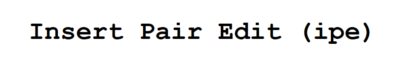
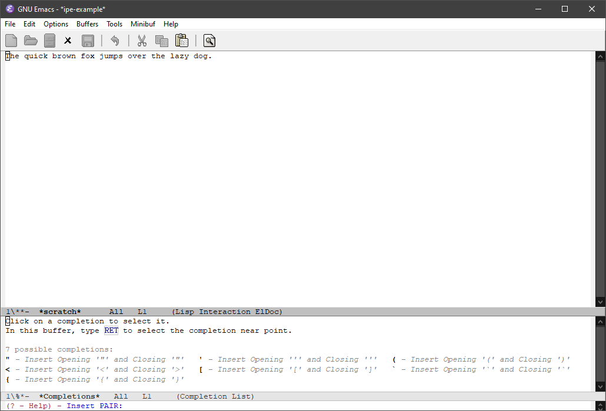
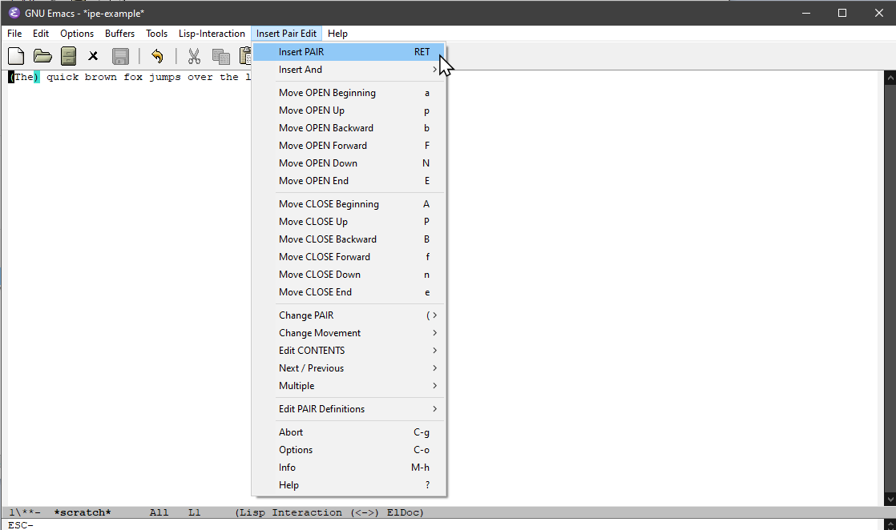
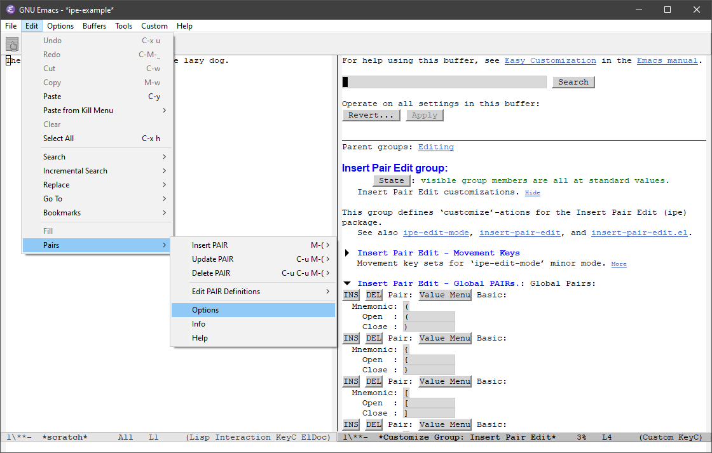
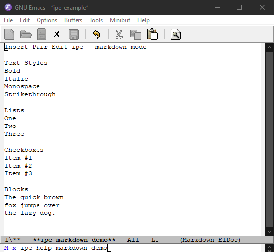
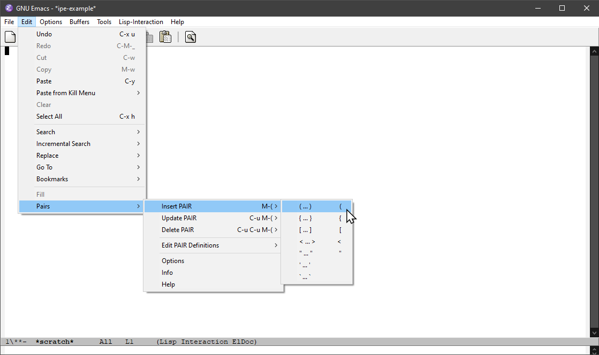
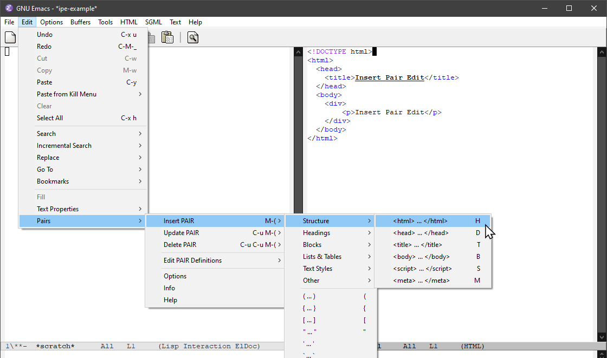

----------------------------------------------------------------------
# insert-pair-edit

This project defines a [GNU Emacs](https://www.gnu.org/software/emacs/)
package, `insert-pair-edit`.  This package supplies commands that are
a more feature rich alternative to the standard `M-(` **Emacs**
keybinding, (`insert-parentheses`).

----------------------------------------------------------------------
## Overview

The `insert-pair-edit` package supplies commands to _insert_ (and
also, _update_, _edit_ and _delete_) "PAIRs" within an **Emacs**
buffer.  These _PAIRs_ consist of _OPEN_ and _CLOSE_ strings that
delimit text in some fashion.  (This could be a simple open and close
parentheses, `(` and `)`, or, it could be a more complex pair of
strings that are used within a programming language.)

The main entry point to the `insert-pair-edit` package is the
**Emacs** interactive command `insert-pair-edit`.  When executed, this
command will prompt the user to enter a _MNEMONIC_ identifying a
(customizable) _PAIR_ via the **Emacs** `minibuffer`.



Selection of a _MNEMONIC_ will cause two overlays to be inserted into
the buffer.  These overlays represent the _OPEN_ and _CLOSE_ strings
of the _PAIR_ to be inserted.

These overlays can then be either: immediately inserted into the
buffer, or, more importantly, _moved_ about the buffer to correctly
surround the text to be enclosed by the _PAIR_.

----------------------------------------------------------------------
## Editing PAIRs



After adding the _OPEN_ and _CLOSE_ overlays into the buffer, the
`insert-pair-edit` command starts `ipe-edit-mode` to enter the
**Insert Pair Edit (ipe)** minor mode.

The **Insert Pair Edit (ipe)** minor mode supplies commands to
move these _OPEN_ and _CLOSE_ overlays about the buffer.  When
positioned correctly, these _OPEN_ and _CLOSE_ overlays can then
either be inserted `<RET>` (`ipe-edit--insert-pair`), or discarded
`C-g` (`ipe-edit--abort`).

The **Insert Pair Edit (ipe)** minor mode also supplies additional
commands to:

* Change the _PAIR_ to be inserted on-the-fly.
* Change the 'lexical units' used by the movement commands.
* Operate on the _CONTENTS_ of the _PAIR_ (i.e. the text between the
  _OPEN_ and _CLOSE_ overlays.)  Text can be copied, deleted, replaced
  and case converted.
* Search for (and _edit_) other _PAIRs_.
* Operate on multiple _PAIRs_ at once.
* Escape characters between the _OPEN_ and _CLOSE_ strings.

Customizations for the mode can be found under the `ipe` group.



-------------------------------------------------------------------
## Mode-Specific

The set of _PAIRs_ available for editing are defined _per-major-mode_.



Example _PAIR Definitions_ are supplied for:

* TexInfo
* HTML
* Markdown

-------------------------------------------------------------------
## Pairs Menu



Most of the functionality of the **Insert Pair Edit (ipe)** package
can also be accessed via the **Emacs** menubar.  If running **Emacs**
in an environment which supports menus, the `insert-pair-edit` package
can add an extra `Pairs` sub-menu to the standard **Emacs** `Edit`
menu item.

The set of _PAIRs_ listed under the `Pairs` -> `Insert PAIR` /
`Update PAIR` / `Delete PAIR` sub-menus will change dynamically based
upon the current buffer's `major-mode`.



Selecting a menu item under `Insert PAIR` will insert the selected
_PAIR_ into the current buffer around _POINT_, and enter
`ipe-edit-mode`.

Selecting a menu item under `Update PAIR` will update the _nearest_
_PAIR_ (of the given type) and enter `ipe-edit-mode`.

Selecting a menu item under `Delete PAIR` will delete the _nearest_
_PAIR_ (of the given type) and remain in the current **Emacs** mode.

----------------------------------------------------------------------
## Installation:

Download the `insert-pair-edit` project:

```
git clone https://github.com/BriansEmacs/insert-pair-edit.el <path-to-download-dir>/ipe
```

Add the following to your `.emacs` file:

```
(add-to-list 'load-path "<path-to-download-dir>/ipe"))
(add-to-list 'load-path "<path-to-download-dir>/ipe/modes"))
(require 'insert-pair-edit)
(global-set-key (kbd "M-(") 'insert-pair-edit)
```

----------------------------------------------------------------------
## Further Help

After installation: from the Emacs `Edit` menu:

```
Edit >
  Pairs >
    Info
    Help
```

From the keyboard:

```
M-x ipe-help
M-x ipe-help--info
```

----------------------------------------------------------------------
