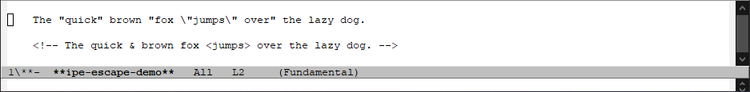

[![MELPA][melpa-badge]][melpa-link]
[![Github Actions Badge][github-actions-badge]][github-actions-link]

  [melpa-badge]: https://www.melpa.org/packages/ipe-badge.svg
  [melpa-link]: https://www.melpa.org/#/ipe
  [github-actions-badge]: https://github.com/BriansEmacs/insert-pair-edit.el/actions/workflows/melpazoid.yml/badge.svg
  [github-actions-link]: https://github.com/BriansEmacs/insert-pair-edit.el/actions/workflows/melpazoid.yml


----------------------------------------------------------------------
# insert-pair-edit


This project defines a [GNU Emacs](https://www.gnu.org/software/emacs/) 
package, `ipe` (_"`i`"nsert-"`p`"air-"`e`"dit_).  This package supplies
commands that are a more feature rich alternative to the standard `M-(`
**Emacs** keybinding, (`insert-parentheses`).

----------------------------------------------------------------------
## Overview

The `ipe` package supplies commands to _insert_ (and also, _update_,
_edit_ and _delete_) "PAIRs" within an **Emacs** buffer.  These
_PAIRs_ consist of _OPEN_ and _CLOSE_ strings that delimit text in
some fashion.  (This could be a simple open and close parentheses, `(`
and `)`, or, it could be a more complex pair of strings that are used
within a programming language.)

The main entry point to the `ipe` package is the **Emacs** interactive
command `ipe-insert-pair-edit`.  When executed, this command will
prompt the user to enter a _MNEMONIC_ identifying a (customizable)
_PAIR_ via the **Emacs** `minibuffer`.


Selection of a _MNEMONIC_ will cause two overlays to be inserted into
the buffer.  These overlays represent the _OPEN_ and _CLOSE_ strings
of the _PAIR_ to be inserted.

These overlays can then be either: immediately inserted into the
buffer, or, more importantly, _moved_ about the buffer to correctly
surround the text to be enclosed by the _PAIR_.

----------------------------------------------------------------------
## Editing PAIRs


After adding the _OPEN_ and _CLOSE_ overlays into the buffer, the
`ipe-insert-pair-edit` command starts the **Insert Pair Edit**
minor mode (`ipe-edit-mode`)

The **Insert Pair Edit (ipe)** minor mode supplies commands to
move these _OPEN_ and _CLOSE_ overlays about the buffer.  When
positioned correctly, these _OPEN_ and _CLOSE_ overlays can then
either be inserted `<RET>` (`ipe-edit--insert-pair`), or discarded
`<C-g>` (`ipe-edit--abort`).

The **Insert Pair Edit (ipe)** minor mode also supplies additional
commands to:

* Change the _PAIR_ to be inserted on-the-fly.


* Change the 'lexical units' used by the movement commands.


* Operate on the _CONTENTS_ of the _PAIR_ (i.e. the text between the
  _OPEN_ and _CLOSE_ overlays.)  Text can be copied, deleted, replaced
  and case converted.


* Search for (and _edit_) other _PAIRs_.


* Operate on multiple _PAIRs_ at once.


* Escape characters between the _OPEN_ and _CLOSE_ strings.


Customizations for the mode can be found under the `ipe` group.


-------------------------------------------------------------------
## Mode-Specific

The set of _PAIRs_ available for editing are defined _per-major-mode_.


Example _PAIR Definitions_ are supplied for:

* Markdown
* TexInfo
* HTML

-------------------------------------------------------------------
## Pairs Menu


Most of the functionality of the `ipe` package can also be accessed
via the **Emacs** menubar.  If running **Emacs** in an environment
which supports menus, the `ipe` package can add an extra `Pairs`
sub-menu to the standard **Emacs** `Edit` menu item.

If the `Pairs` menu is enabled, the set of _PAIRs_ listed under the
`Pairs` -> `Insert PAIR` / `Update PAIR` / `Delete PAIR` sub-menus
will change dynamically based upon the current buffer's `major-mode`.


Selecting a menu item under `Insert PAIR` will insert the selected
_PAIR_ into the current buffer around _POINT_, and enter
`ipe-edit-mode`.

Selecting a menu item under `Update PAIR` will update the _nearest_
_PAIR_ (of the given type) and enter `ipe-edit-mode`.

Selecting a menu item under `Delete PAIR` will delete the _nearest_
_PAIR_ (of the given type) and remain in the current **Emacs** mode.

----------------------------------------------------------------------
## Installation

1a. Download the `ipe` package from [MELPA](https://melpa.org): 

```lisp
(require 'package)
(add-to-list 'package-archives '("melpa" . "http://melpa.org/packages/"))
(package-initialize)
(package-install 'ipe)
```

Or:

1b. Download the `insert-pair-edit.el` project source:

```
git clone https://github.com/BriansEmacs/insert-pair-edit.el <path-to-download-dir>/ipe
```

And add the following to your `.emacs` file:

```lisp
(add-to-list 'load-path "<path-to-download-dir>/ipe")
(add-to-list 'load-path "<path-to-download-dir>/ipe/modes")
```

2. Add the following to your `.emacs` file:

```lisp
(require 'ipe)
(global-set-key (kbd "M-(") 'ipe-insert-pair-edit)
```

3. You may also want to enable the `ipe` "Pairs" menu:

```lisp
(customize-save-variable 'ipe-menu-support-p t)
```

4. You may also want to bind the other `ipe` commands:

```lisp
(global-set-key (kbd "A-(") 'ipe-insert-pair-edit-update)
(global-set-key (kbd "H-(") 'ipe-insert-pair-edit-delete)
```

5. You may also want to load the "example" modal PAIR mappings:

```lisp
(require 'ipe-markdown-mode)
(require 'ipe-texinfo-mode)
(require 'ipe-html-mode)
```

----------------------------------------------------------------------
## Further Help

After installation: 

From the keyboard:

```lisp
M-x ipe-help
M-x ipe-help-info
M-x ipe-options
```

(If you have enabled `ipe-menu-support-p`) From the Emacs `Edit` menu:

```
Edit >
  Pairs >
    Options
    Info
    Help
```

----------------------------------------------------------------------
